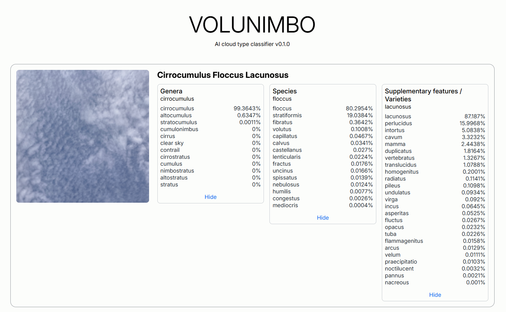

# Volunimbo

AI cloud type classifier.

A custom built cloud classifier trained with Keras that runs locally in-browser using Tensorflow JS. The
application is built on 3 separate models, reflecting cloud nomenclature being formatted as such:
\<genus> \[species] [list of supplementary features and varieties], where names wrapped with <> are
required and [] are optional. Genus and species have mutually exclusive names, whilst supplementary features
and varieties are not, allowing appending as many names as applicable, apart from one exception (which I have
not hardcoded to prevent yet).

All 3 models share a common convolutional neural network that was trained on the genera dataset as it had the
most data, with the other models being made by transfer-learning on the common CNN.

Data used to train the model is from the following (This project was developed as my ICS4U final project and is
made for educational purposes, please don't sue me):

Shared CNN and genera classifier:

- [HuaYun BJUT MIP Cloud Dataset](https://github.com/SadaharuZL/HuaYun-BJUT-MIP-Cloud-Dataset)
- [TJNU ground-based cloud dataset (GCD)](https://github.com/shuangliutjnu/TJNU-Ground-based-Cloud-Dataset)
- [Some Kaggle competition](https://www.kaggle.com/competitions/cloud-type-classification2/data)
- [CCSN dataset](https://dataverse.harvard.edu/dataset.xhtml?persistentId=doi:10.7910/DVN/CADDPD)

Species and supplementary features/varieties classifier:

- [WMO Cloud Atlas](https://cloudatlas.wmo.int/en/search-image-gallery.html)
- [Cloud Appreciation Society](https://cloudappreciationsociety.org/gallery/)

The current results of the training are organized in the table below.

| Model   | Training accuracy | Validation accuracy |
| ------- | ----------------- | ------------------- |
| Genera  | 96.7%             | 89.4%               |
| Species | 60%               | 54%                 |
| Supp.   | 70%               | 56.4%               |

Evident from the results, the species and supplementary features/varieties models are much weaker than the
genera model. This is likely due to bad training data, as the data was compiled from scraping websites. However,
the supplementary model is likely architected non-ideally, as due to the nature of its nomenclature, image
segmentation should be used instead.

It is my goal to improve this project in the future, so stay tuned.
